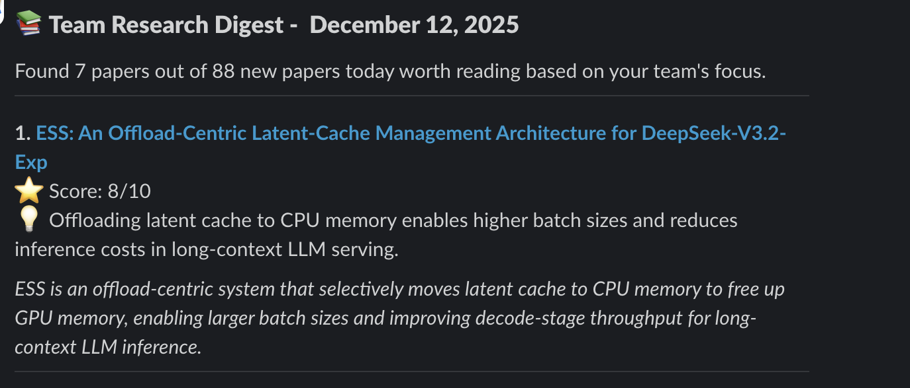

Researchers face an impossible task in staying up to date within their field. In AI and Machine Learning alone, [arXiv](https://arxiv.org/) publishes 50-100 new papers daily. Multiply that across computer science, physics, biology, and other domains, and you're looking at hundreds of potentially relevant papers flooding in every single day.

The result? Teams fall behind on breakthrough papers. Important work gets buried under noise. And the constant feeling of "I should be reading more papers" becomes just another source of stress.

We built something to fix this problem. Using the [Doubleword Batch API](https://batched.doubleword.ai/), we created an automated research digest that costs pennies to run and delivers only the papers that actually matter to our team.

<!-- truncate -->

## The Information Overload Problem

Let's put some numbers to this. If you're working on large language models:
- **~75 papers per day** match broad keywords like "LLM" or "transformers"
- **2-3 minutes per paper** to open the PDF, read the abstract, and determine if it's relevant to your specific work
- **2.5+ hours of daily triage** just to figure out what's worth your time
- **Most papers (80%+)** turn out to be irrelevant 

That's before you've read a single paper deeply. It's unsustainable.

Traditional solutions fall short:
- **Manual keyword filters** are too broad (you get everything mentioning "transformer")
- **Citation-based alerts** miss emerging work from new researchers
- **Generic digests** don't understand your team's specific focus
- **RSS feeds** just give you more volume, not better signal

What researchers need isn't more data but rather it's intelligent curation that understands context and priorities.

## Why Batch APIs Are Perfect for This

Here's the thing about research digests - they don't need to be real-time. You don't need an answer in 200ms, you just need good answers every morning. This makes research evaluation a perfect candidate for batch processing:

### The Economics Are Compelling

Let's look at real numbers from our production system evaluating ~70 papers daily:

| Provider | Model | Daily Cost | Annual Cost | vs Doubleword |
|----------|-------|------------|-------------|---------------|
| **Doubleword Batch** | **Qwen3-VL-30B** | **$0.0033** | **$12** | **Baseline** |
| OpenAI | GPT-4o-mini | $0.01 | $36 | 3x more expensive |
| Anthropic | Claude Sonnet 4.1 | $0.219 | $80 | 7x more expensive |

At $12/year, this digest becomes a no-brainer to run in the background. Even if usage tripled, we'd still be under $40/year. That's the difference between "we should probably turn this off" and "why wouldn't we run this?"

### Perfect for Parallel Evaluation

Each paper evaluation is independent. Paper A's relevance score doesn't depend on Paper B's. This means:
- All 100+ paper evaluations run in parallel
- No waiting for sequential processing
- Results arrive in bulk when ready with SLAs of 1 or 24 hours
- No rate limit concerns

### Set It and Forget It

With batch processing, you submit your job and walk away. The system:
- Queues all evaluation requests
- Processes them efficiently in parallel
- Delivers results when complete
- Handles retries automatically

No babysitting required. No timeout errors. No rate limit headaches.

## How the Pipeline Works

#### Step 1: Smart Paper Fetching from arXiv 

  ```
  arXiv API → Filter by Keywords → Remove Duplicates → Filter by Date
  ```

  Our system hits arXiv's API looking for papers matching the keywords we have outlined. We track what papers we've already seen so you never evaluate a paper twice.

  We also handle arXiv's weekend schedule - since papers aren't published on Saturdays or Sundays, Monday's run automatically looks back three days to catch Friday's papers.

#### Step 2: Batch Evaluation Setup

For each paper, we create a structured evaluation request:

```json
{
  "custom_id": "2312.12345",
  "method": "POST",
  "url": "/v1/chat/completions",
  "body": {
    "model": "Qwen/Qwen3-VL-30B-A3B-Instruct-FP8",
    "messages": [
      {
        "role": "system",
        "content": "You are a model that must output ONLY valid JSON..."
      },
      {
        "role": "user",
        "content": "TEAM PROFILE:\nFocus: Building a batched API server...\n\nEvaluate this paper:\nTITLE: ...\nABSTRACT: ..."
      }
    ]
  }
}
```

The key is the team profile. We tell the model exactly what we care about. We break this down by telling the model the teams focus, interests, and what to avoid. This context makes all the difference. Generic relevance scoring gives you noise. Context-aware evaluation gives you signal.

#### Step 3: Submit and Wait

All evaluation requests get bundled into a single JSONL file and submitted as one batch job:

```python
batch_file = client.files.create(
    file=open(batch_file_path, 'rb'),
    purpose='batch'
)

batch = client.batches.create(
    input_file_id=batch_file.id,
    endpoint="/v1/chat/completions",
    completion_window="1h"
)
```

#### Step 4: Parse and Rank Results

When results come back, we parse each evaluation:

```json
{
  "relevance_score": 9,
  "is_relevant": true,
  "needs_summary": true,
  "summary": "Proposes a novel batching strategy that reduces inference costs by 40% through dynamic request grouping.",
  "key_insight": "Batching efficiency depends more on request diversity than batch size."
}
```

Papers scoring ≥7 make the cut. We rank by relevance score and select the top 10.

#### Step 5. Deliver to Slack

The final digest lands in Slack as a rich, formatted message.



Each paper includes:
- Direct link to arXiv
- Relevance score
- Key insight (one-sentence takeaway)

## Real-World Impact

Since deploying our arXiv digest, we've seen:
- **Time saved**: ~12 hours per week across the team 
- **Papers read**: 3-5 relevant papers per week (up from ~1)
- **Signal-to-noise**: Only 8-10 papers flagged from 70-100 daily (89% filtered out)

More importantly research stopped being an afterthought. When relevant papers land in Slack every morning, people actually read them. The barrier to staying current dropped to zero.

And because it costs essentially nothing to run ($1/month), there's no pressure to "justify the expense" or turn it off during slow periods. It just runs, quietly keeping the team informed.

## Beyond Research: The Digest Use Case Pattern

This architecture isn't just for academic papers. The pattern of "fetch → evaluate in batch → curate → deliver" applies to countless scenarios:

- **News Monitoring** - PR teams tracking brand mentions, compliance teams monitoring regulatory news
- **Product Reviews Analysis** - Product managers getting weekly "what users are saying" digests
- **Social Media Monitoring** - Marketing teams tracking campaign performance
- **Legal/Compliance Scanning** - Legal teams staying ahead of regulatory changes
- **Technical Documentation Updates** - DevOps teams monitoring infrastructure dependencies
- **Job Market Intelligence** - Recruiting teams benchmarking compensation and requirements

The common thread: large volumes of unstructured data that need intelligent filtering before they're useful. Batch APIs make these use cases economically viable.

## Wrapping Up

Information overload is a real problem. As the volume of content explodes—research papers, news articles, product reviews, social media—the challenge isn't access to data. It's filtering for what matters.

Batch APIs make intelligent, at-scale curation economically viable. For **$1/month** ($12/year), we turned an impossible task into a solved problem. 

The pattern extends far beyond academic research. Anywhere you have high-volume data that needs evaluation but not immediate results, batch processing is the answer.

---

**Try it yourself**: The complete arXiv digest code is available on Github [here](https://github.com/doublewordai/arxiv-daily-digest)!

**Want to build your own digest?** The Doubleword Batch API makes it economically viable. Sign up for our private preview to get your first batch run for free [here](https://docs.google.com/forms/d/1U2rlKezXEbuAPPqRmdhk9VDHH-9lvCFEDw7h3vZfUvA/edit#responses).

**Questions or ideas?** We'd love to hear what digest use cases you're building. Share them in the comments or reach out to our team at hello@doubleword.ai.