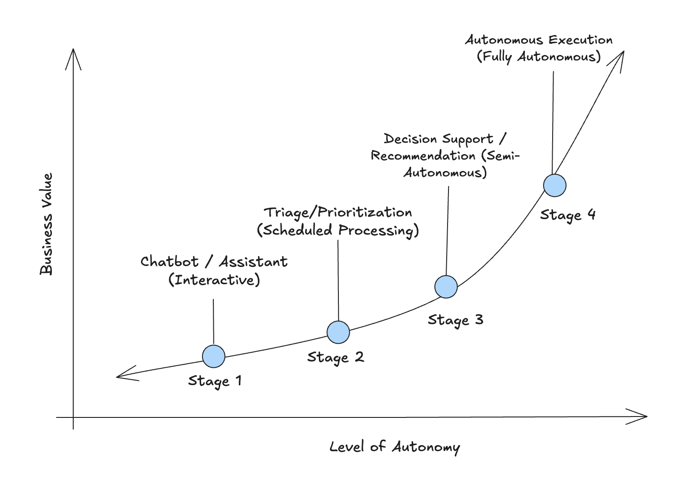

# Why Batch Inference Matters: Moving from AI Assistants to Autonomous Agents

The initial wave of Generative AI adoption focused on augmenting human work - chatbots that help developers write cleaner code, assistants that polish our emails, or tools that speed up content creation. These productivity enhancements have proven their value tenfold, as almost every individual has a version of ChatGPT open to assist them during their day. But they represent just the beginning of what's possible with AI. 

The next evolution isn't about making humans faster - it's about trusting AI to work independently. As organizations move from interactive chatbots to autonomous agents, the shift requires a fundamental change in mindset. Can we let an LLM handle entire workflows without constant human supervision? The most significant business transformation happens when AI becomes a trusted teammate that takes ownership of repetitive, high-volume tasks and delivers results on its own timeline.

<!-- truncate -->

## Understanding Batch Workloads

Not every AI task needs an answer in milliseconds. There's an entire category of work where immediacy isn't the priority - processing happens in the background, often overnight or on a schedule, with results delivered when they are needed rather than instantly. These are what we call **batch workloads**: "fire-and-forget" AI tasks where no one is waiting at their screen, no human is in the loop requiring immediate feedback, and the work completes on its own timeline without the constraints of real-time interaction.

Common examples include:
- Nightly content moderation sweeps across millions of user posts, flagging policy violations for human review the next morning
- Daily research literature analysis that processes hundreds of new papers, extracting key findings and relevance scores for researchers
- Weekly customer feedback analysis that categorizes and summarizes thousands of support tickets, identifying emerging issues and sentiment trends
- Monthly document processing for compliance teams, where contracts or reports are analyzed for specific clauses, risks, or anomalies

To unlock greater business value from AI, organizations need to move beyond real-time, human-driven workloads. As illustrated in the diagram below, workloads that operate with more autonomy - processing data independently on their own schedule - will deliver higher value to the organization.

## The Economics of Batch Inference
These autonomous workloads - often called batch inference - represent a fundamental shift in how AI delivers value. Instead of processing requests one at a time as users wait, batch workloads process thousands or millions of inputs in parallel. This approach unlocks significant cost advantages, as providers, such as Doubleword, can offer up to 75% discounts for batch processing. 

More importantly, batch inference enables AI to tackle problems that would be economically impossible in real-time - like analyzing every customer interaction from the past month, processing an entire claims backlog, or screening thousands of medical images overnight. The economics are compelling - the same AI capability that costs $X per real-time query costs a fraction of that when run as a scheduled batch job, making previously cost-prohibitive use cases suddenly viable at scale. 

Let's walk through a practical example to see how a single use case evolves from interactive assistance to autonomous operation.

## Illustrative Use Case: AI Powered Radiology Assistance 

1. **Stage 1 - Interactive Assistant:** Radiologists use an AI chatbot while reviewing scans, asking questions and receiving real-time suggestions. This accelerates individual reviews but remains constrained by human speed and attention. 
2. **Stage 2 - Scheduled Triage:** The department shifts to overnight batch processing. The AI analyzes hundreds of scans, flags critical findings, and prioritizes the morning worklist. Urgent cases are surfaced first and potential abnormalities are pre-identified, making their reviews more efficient.
3. **Stage 3 - Draft Generation:** As trust in the system grows, the AI generates complete draft reports - findings, measurements, preliminary diagnoses. The AI handles 80% of the analytical work; humans review and approve AI generated work, ensuring accuracy and addressing edge cases
4. **Stage 4 - Autonomous Screening:** Eventually, after robust evaluation and with proper guardrails, the AI operates fully autonomously - processing thousands of scans weekly, automatically clearing normal cases, and only surfacing abnormal findings to specialists. 

## Taking Action: Building for Autonomous Workloads
The path to transformational AI value requires a strategic shift in how organizations architect their AI systems. If your team is still primarily using AI through interactive chatbots and real-time assistants, you're likely leaving significant business value on the table. The question isn't whether to move toward autonomous workloads - it's how quickly you can make that transition while maintaining quality and trust.

As organizations begin deploying these autonomous AI pipelines, the technical requirements become critical. You need consistent performance across large job queues, transparent monitoring and error handling, and pricing models that make high-volume processing economically viable. Doubleword is built specifically to meet these requirements - offering batch inference infrastructure designed for reliability at scale.

## Ready to explore autonomous AI workloads for your organization? 

We're opening a private preview for companies looking to move beyond real-time inference and unlock the full potential of batch processing. [Sign up here](https://docs.google.com/forms/d/e/1FAIpQLScl5WPU4xlubaBkGRAFggJ5iuKBKVwkrhouXJIIul2BhIFHAg/viewform) to learn how to architect reliable, cost-effective AI systems that operate at scale.
